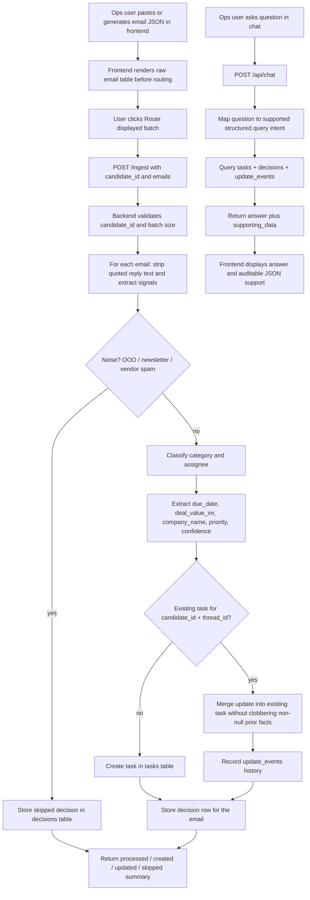

# Sales Inbox → Task Router

**candidate_id:** `replace.with.your.real.email@example.com`  
**Backend URL:** `https://your-backend.example.com`  
**Frontend URL:** `https://your-frontend.example.com`  
**Public GitHub repo:** `https://github.com/your-user/sales-inbox-router`

> Replace the placeholder URLs above with the deployed backend, deployed frontend, and public GitHub repository URLs before submission. Before submission, replace `replace.with.your.real.email@example.com` with your real email everywhere and keep the `candidate_id` byte-identical across README, `.env`, frontend requests, backend requests, and the submission form.

## Why this exists

A sales inbox is not just email; it is an operational queue. High-value RFPs, sponsorship deadlines, finance follow-ups, and partnership requests can be hidden among newsletters, out-of-office replies, and vendor spam. If one person manually reads every message, important work can sit untouched for days.

This project turns the inbox into a routed task stream:

1. **Important emails become tasks.** RFPs, demos, sponsorships, invoices, and partnerships are assigned to the right owner.
2. **Noise does not become work.** Out-of-office replies, newsletters, and unsolicited vendor spam are skipped instead of dumped into triage.
3. **Replies update existing work.** Follow-ups in the same thread patch the existing task instead of creating duplicates.
4. **The operator can inspect decisions.** Every processed email is stored with a decision, confidence, and reasoning so the frontend and chat interface can explain what happened.
5. **Chat answers are grounded in stored data.** The chat endpoint computes counts and lists from the database first, then returns `supporting_data` beside the answer so numbers are auditable.

## What we built

### Backend API

The FastAPI backend is the single public backend surface expected by the assignment. It contains both the grader-facing Task API and the app-facing endpoints used by the frontend.

| Endpoint | Purpose |
|---|---|
| `POST /tasks` | Create a task with exact enum validation for `assignee_id`, `category`, and `priority`. |
| `PATCH /tasks/{task_id}` | Update an existing task when a thread reply changes deadline, value, priority, or routing data. |
| `GET /tasks?candidate_id=...` | Return raw tasks for the grader and for debugging. |
| `DELETE /tasks/{task_id}` | Delete one task during local development. |
| `GET /users` | Return the team roster. |
| `POST /ingest` | Synchronously process up to 100 emails, create/update/skip decisions, and persist results. |
| `GET /api/tasks` | Return tasks plus stored decision metadata for the frontend. |
| `GET /api/stats` | Return processed/created/updated/skipped counts and category breakdowns. |
| `POST /api/chat` | Answer natural-language questions using SQL-backed supporting data. |

### Routing logic

The router handles the core business rules from the brief:

- **Aarti / Enterprise:** RFPs, RFIs, tenders, PSU/government tenders, and deals above ₹10,00,000.
- **Rohit / SMB:** demo requests, product enquiries, pricing/trial requests, and deals at or below ₹10,00,000.
- **Meera / Marketing:** webinar, event, conference, sponsorship, content collaboration, PR, and media requests.
- **Karan / Alliances:** reseller, channel partner, partnership, and technology integration proposals.
- **Divya / Finance:** invoices, purchase orders, GST/GSTIN, payment reminders, overdue payments, and vendor billing.
- **Triage:** ambiguous messages or messages with multiple competing owners.
- **Skipped:** out-of-office replies, newsletters, and likely unsolicited vendor spam.

The implementation is intentionally conservative: if the system cannot cleanly determine a due date, deal value, or company name, it leaves the field as `null` instead of fabricating data.

### Persistence and idempotency

SQLite is used by default through `DATABASE_URL=sqlite:///./router.db`. The schema stores three kinds of records:

1. **`tasks`** — current task state exposed by `/tasks`.
2. **`decisions`** — one stored decision per processed email, including skipped emails that never become tasks.
3. **`update_events`** — a history of thread replies that updated existing tasks.

Idempotency is enforced with unique keys on `(candidate_id, source_email_id)` and `(candidate_id, thread_id)`, plus decision-level deduplication on `(candidate_id, email_id)`. This prevents repeated ingest runs from creating duplicate tasks and lets thread replies patch the original task.

### Frontend

The React/Vite frontend is a focused operator console:

1. Paste a JSON email batch or generate 250 sample emails.
2. Render the raw pasted/generated emails as a plain table before routing.
3. Submit the visible batch to `/ingest`.
4. Ask questions such as:
   - “How many emails were proposal or RFP related?”
   - “How many were marketing versus spam?”
   - “Show me everything in triage and why.”
   - “Which high-priority tasks are low confidence?”
   - “How many emails were about GST refunds?”

The frontend does not call Gemini and does not talk directly to a separate Task API. It only talks to this backend.

## How chat avoids hallucinated numbers

The chat flow is deliberately grounded:

1. The user asks a question in the frontend.
2. The frontend sends `{ candidate_id, query }` to `POST /api/chat`.
3. The backend maps the question to a supported query intent.
4. The backend runs SQL against stored `tasks`, `decisions`, and `update_events`.
5. The response includes both a human-readable `answer` and machine-checkable `supporting_data`.

If the user asks for an unsupported action, such as sending an email, the chat endpoint refuses. If the user asks for a category with zero matches, it returns zero instead of inventing activity.

When `GEMINI_API_KEY` is configured, `/api/chat` asks Gemini to rephrase the already-computed draft answer. Gemini receives the SQL-backed `supporting_data` and strict instructions not to add or change numbers; if the Gemini call fails or no key is present, the backend returns the deterministic draft answer.


## Whole agentic flow diagram

The system is intentionally split into a deterministic routing core plus an auditable chat layer. The browser never sees secrets and never writes directly to the raw Task API; it talks only to the backend.



### Flow in plain English

1. The operator pastes emails or generates sample emails.
2. The frontend shows the raw email table first, before routing, so the operator can inspect exactly what is being processed.
3. The frontend sends the batch to `POST /ingest`.
4. The backend processes every email synchronously.
5. Spam, newsletters, and out-of-office replies are stored as skipped decisions, not tasks.
6. Real business emails become tasks or update existing thread tasks.
7. Every email gets a stored decision row so chat and stats are based on saved ground truth.
8. Chat questions are answered from database queries and include `supporting_data`, so counts can be checked.

## How to run this code locally

### 1. Start the backend

```bash
cp .env.example .env
pip install -r requirements-dev.txt
uvicorn backend.main:app --reload
```

Backend URL:

```text
http://localhost:8000
```

Quick backend checks:

```bash
curl http://localhost:8000/health
curl http://localhost:8000/users
```

### 2. Start the frontend

Open a second terminal:

```bash
cd frontend
npm install
VITE_BACKEND_URL=http://localhost:8000 npm run dev
```

Then open the Vite URL printed in the terminal, usually:

```text
http://localhost:5173
```

### 3. Try the full workflow

In the frontend:

1. Click **Generate 250 sample emails**.
2. Confirm the raw table appears.
3. Click **Route displayed batch**.
4. Ask a chat question, for example:
   - `How many marketing versus RFP emails came in?`
   - `Show me everything sitting in triage and why.`
   - `How many emails were about GST refunds?`

### 4. Run checks

```bash
python -m py_compile backend/*.py tests/*.py
pytest -q
```

If dependency installation is blocked by your network, install the packages from `requirements-dev.txt` in a Python environment with package-index access and rerun the same commands.


## Environment variables

Copy `.env.example` to `.env` and update values as needed.

| Variable | Required | Purpose |
|---|---:|---|
| `CANDIDATE_ID` | Yes | Submission identity. Replace the example value with your real email and use the exact same value everywhere. |
| `DATABASE_URL` | Yes | SQLite path locally, or another persistent database URL in deployment. |
| `GEMINI_API_KEY` | No for this deterministic baseline | Reserved for future LLM phrasing/classification. Never expose it to browser JavaScript. |
| `GEMINI_MODEL` | No | Future Gemini model selection. |
| `FRONTEND_ORIGIN` | No | Frontend origin for production CORS tightening. |
| `BACKEND_URL` | No | Backend base URL used in deployment notes. |
| `VITE_CANDIDATE_ID` | Yes for frontend deployment | Same real email as `CANDIDATE_ID`; Vite exposes only this public identifier, not secrets. |
| `VITE_BACKEND_URL` | Yes for frontend deployment | Public backend URL used by the browser. |

## Testing

```bash
python -m py_compile backend/*.py
pytest -q
```

`tests/test_api.py` covers:

- bad enum error shape on `POST /tasks`,
- idempotent repeated `/ingest`,
- stable task counts through `GET /tasks`,
- grounded zero-count chat response for GST refunds.

## Deployment checklist

Before submitting:

- Deploy the backend publicly over HTTPS.
- Deploy the frontend publicly over HTTPS.
- Update the Backend URL, Frontend URL, and Public GitHub repo at the top of this README.
- Confirm `GET /health`, `GET /users`, `GET /tasks?candidate_id=<your-real-email>`, `POST /ingest`, and `POST /api/chat` respond on the same backend base URL.
- Keep `.env` and any API keys out of git.

## What I would improve next

- Add Gemini as a secondary classifier only for low-confidence or ambiguous emails.
- Store richer subcategory metadata, such as reseller versus integration partner, so chat can answer deeper breakdowns honestly.
- Add a reviewer screen for correcting decisions and using those corrections as future examples.
- Add production database migrations instead of simple SQLite table creation.
- Add deployment-specific CORS origins instead of permissive local-development CORS.
